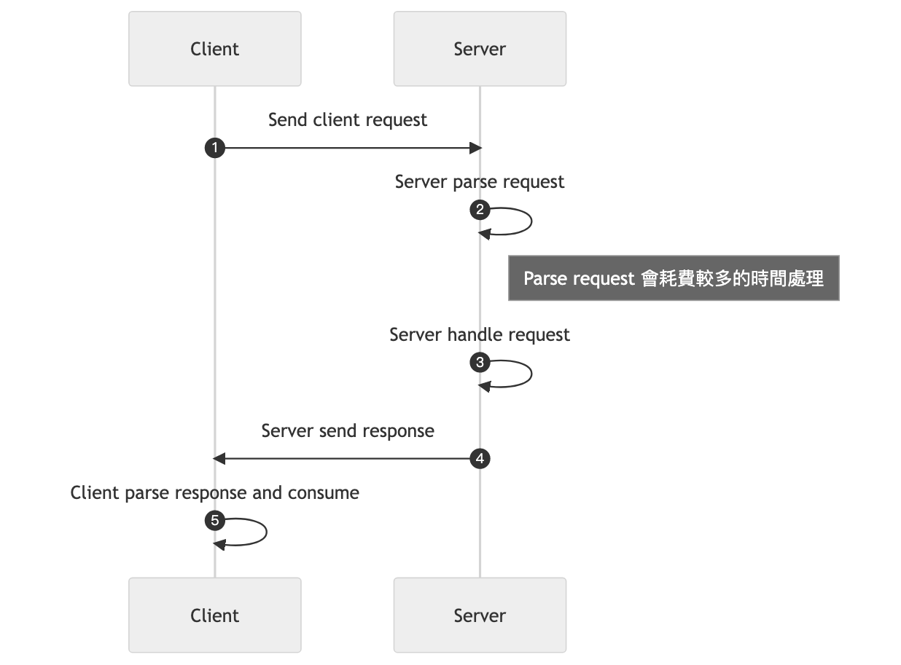

進行的 flow 流程如下



Request 的定義由 Client 端和 Server 端共同定義，例如 HTTP Request

```http
GET / HTTP/1.1
...
Headers
...
Body
...
```

可以透過 `curl --trace` 來查看送出的 Request 與 Response

```sh
curl -v --trace out.txt http://www.shengtai.me
```

最常見的溝通模式，常使用於以下場景

- Web, HTTP, DNS, SSH
- RPC (remote procedure call)
- DB Query
- RESTful API, GraphQL

例如建立將圖片上傳至 Server 的服務就可以透過 Request Response Pattern 來達成。

可以一次將 Request 夾帶 Image 上傳至 Server，壞處是若失敗的話就必須全部重新進行上傳。

或是將 Image 切分，分次將 request 夾帶 Image chunk 來分批傳遞，好處是若其中一個 request 失敗的話，可以單獨對此部分重新上傳。

Request Response Pattern 不適用以下的場景

- Notification Server
- Chatting App
- Long Request

