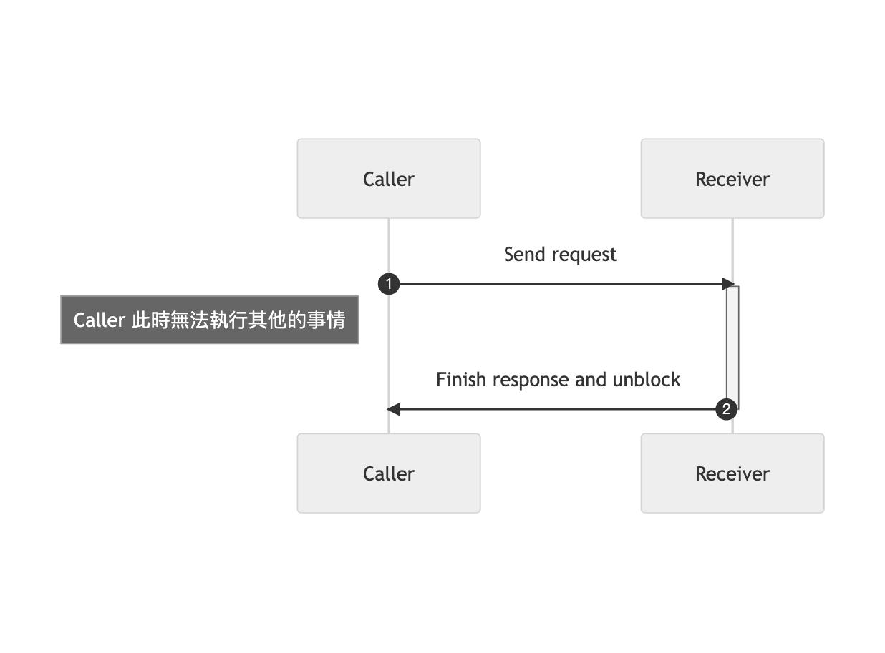
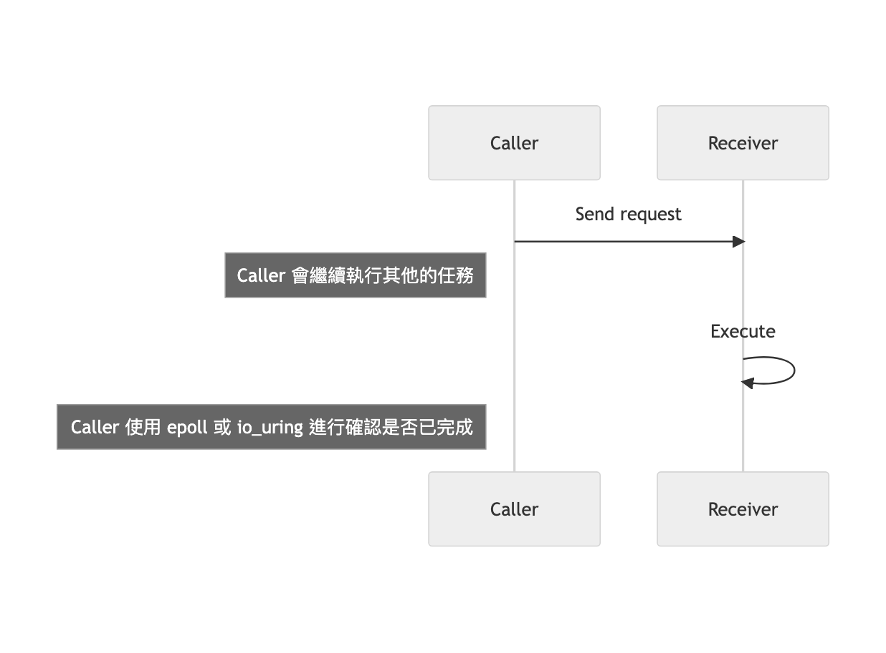

Synchronous IO flow




Asynchronous IO flow



:::note
- [如果这篇文章说不清epoll的本质，那就过来掐死我吧！](https://zhuanlan.zhihu.com/p/63179839)
- [译 Linux 异步 I/O 框架 io_uring：基本原理、程序示例与性能压测(2020)](https://arthurchiao.art/blog/intro-to-io-uring-zh/)
:::

:::note
NodeJS 使用 epoll 來進行非同步的處理，若是無法使用 epoll 的時候，會起一個新的 block thread 來執行任務，main thread 會繼續直行其他的任務
:::

Synchronous 就像是詢問一個人問題，需要等待對方回覆。

Asynchronous 像是寄送 email 進行溝通，不需要一直等待對方的回覆。

以 Client 發送 Request 至 Server 當做範例，Synchronous 會執行完畢後回傳 Response 給 Client，Asynchronous 當 Client 發送 Request 至 Server 時，會將 Request 儲存至 queue 中，並立即返回是否成功排入 queue 中的 Response，輪到該任務時，後端才會進行處理，而 Client 端再經由其它的方式檢查是否完成(例如 polling)。

使用 sync 將會 block 住

```js title="sync.js"
const fs = require('fs');

console.log(1);
const res = fs.readFileSync('test.txt');
console.log('read file ' + res);

console.log(2);

```

```sh
node sync.js
1
read file test
2
```

使用 async 將不會 block

```js title="async.js"
const fs = require('fs');

console.log(1);

fs.readFile('test.txt', (err, buffer) => console.log(buffer.toString()));

console.log(2);

```

```sh
node async.js
1
2
test
```
